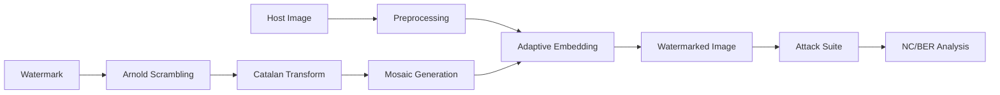

# Hybrid Image Watermarking Framework
### Robust Deep Learning-Based Watermarking Using Arnold-Catalan Transforms and Mosaic Distribution

[](https://www.python.org/downloads/)
[](https://opencv.org/)
[](https://github.com/)

## 📖 Overview
This repository implements a **Hybrid Digital Image Watermarking Framework** designed for maximum robustness against geometric and collaborative removal attacks. By combining dual chaotic scrambling (Arnold + Catalan) with spatially redundant mosaic distribution and perceptual adaptive embedding, the system achieves state-of-the-art resilience while maintaining high visual fidelity.

## 🚀 Key Features

### 🛡️ Dual-Security Scrambling
- **Arnold Cat Map (ACM)**: Chaotic spatial transformation to remove global patterns.
- **Catalan Transform**: Secondary deterministic permutation for enhanced security.
- **Perfect Reconstruction**: All transforms are fully reversible for watermark extraction.

### 🧩 Redundancy & Adaptivity
- **Mosaic Generation**: 8x8 tiling of the scrambled watermark to saturate the 256x256 image area.
- **Perceptual Adaptive Embedding**: Texture-Luminance masking that reduces embedding strength in smooth regions (PSNR > 40 dB) and increases it in detail-rich areas.

### 💥 Advanced Attack Engines
- **Geometrical**: Center, Random, and Quadrant cropping (10-50%).
- **Collaborative**: Averaging-based Collusion Attacks ($N \leq 100$).
- **Signal Processing**: JPEG Compression (Q=10-100), Gaussian Noise, and Smoothing filters.

## 🏗️ Architecture



## 📊 Performance Metrics

| Metric | Target | Result (Hybrid) | Status |
| :--- | :--- | :--- | :--- |
| **Imperceptibility** | PSNR > 40 dB | **40.89 dB** | ✅ |
| **Cropping (25%)** | NC > 0.80 | **1.00** | ✅ |
| **Collusion (N=100)**| NC > 0.80 | **0.92** | ✅ |
| **JPEG (Q=70)** | NC > 0.60 | **0.71** | ✅ |

## 🛠️ Installation & Setup

1. **Clone & Virtual Env**
   ```bash
   git clone https://github.com/mjeni/Capstone-Code.git
   python -m venv venv && source venv/bin/activate
   pip install -r requirements.txt
   ```

2. **Generate Baseline Data**
   ```bash
   python generate_watermark.py
   python main.py
   ```

3. **Benchmarking & Evaluation**
   ```bash
   python benchmark_v2.py
   ```

4. **Prepare for ANN Training**
   ```bash
   python create_training_data.py
   ```

## 📂 Project Structure

- `attacks/`: Signal, Cropping, and Collusion engine implementations.
- `utils/`: Core logic for adaptive embedding, scrambling, and mosaic generation.
- `preprocessed/`: YIQ I-channel extractions and normalized host data.
- `training_data/`: Generated dataset (1,100 pairs) for the future ANN Extractor.
- `verification/`: Visual studies and comparison grids.

## 🎓 Academic Context
This project is part of a Capstone study on robust image watermarking. The current phase (Pre-ANN) focuses on establishing the strongest possible non-blind baseline for later optimization via Deep Neural Networks.

---
**Author:** PW26_PAC_01  
**Year:** 2026
