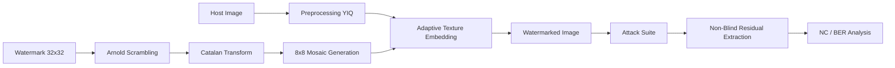

# Hybrid Image Watermarking Framework
### Robust Watermarking Using Arnold-Catalan Transforms and Mosaic Distribution (Pre-ANN Baseline)

[](https://www.python.org/downloads/)
[](https://opencv.org/)
[](https://github.com/)
[](https://github.com/)

## 📖 Overview
This repository implements a **Hybrid Digital Image Watermarking Framework** designed for maximum robustness against geometric and collaborative removal attacks. By combining dual chaotic scrambling (Arnold + Catalan) with spatially redundant mosaic distribution and perceptual adaptive embedding, the system establishes a rigorous, reproducible, non-blind Pre-ANN baseline for subsequent deep learning optimization.

## 🚀 Key Features

### 🛡️ Dual-Security Scrambling
- **Arnold Cat Map (ACM)**: Chaotic spatial transformation to remove global spatial correlations.
- **Catalan Transform**: Secondary deterministic permutation using Blake2b-hashed Catalan sequences for enhanced security and collision-free sort keys.
- **Perfect Reconstruction**: Fully reversible mathematical transformations for watermark extraction.

### 🧩 Redundancy & Adaptivity
- **8x8 Mosaic Generation**: Tiling of the 32x32 scrambled watermark into a 256x256 mosaic to cover the full image area.
- **Perceptual Adaptive Embedding**: Local luminance-texture variance masking that maintains visual imperceptibility in smooth areas ($\text{PSNR} > 41$ dB) while embedding stronger signal in textured regions.

### 💥 Standardized Attack Suite
- **Geometric**: Center, Random (Seeded), and Quadrant cropping (10%, 25%, 50% area removal).
- **Collaborative**: Multi-user averaging-based Collusion Attacks ($N \in \{2, 5, 10, 20, 50, 100\}$) with distinct watermark variants and collaborative noise.
- **Signal Processing**: JPEG Compression ($Q \in \{50, 70\}$), Additive White Gaussian Noise ($\sigma = 0.05$), and Gaussian Smoothing ($k = 3$).

## 🏗️ Architecture


```mermaid
graph LR
    H[Host Image] --> P[Preprocessing YIQ]
    W[Watermark 32x32] --> S1[Arnold Scrambling]
    S1 --> S2[Catalan Transform]
    S2 --> M[8x8 Mosaic Generation]
    P --> AE[Adaptive Texture Embedding]
    M --> AE
    AE --> EW[Watermarked Image]
    EW --> AT[Attack Suite]
    AT --> EX[Non-Blind Residual Extraction]
    EX --> AN[NC / BER Analysis]
```

## 📊 Validated Performance Benchmarks (Pre-ANN Baseline)

Evaluated across the complete fixed test split (**165 DIV2K test images**) with bit-exact seed reproducibility:

| Condition / Attack | Hybrid Framework (NC) | Hybrid (BER) | Baseline Method (NC) | Baseline (BER) | Target / Advantage |
| :--- | :--- | :--- | :--- | :--- | :--- |
| **Imperceptibility (No Attack)** | **0.9979** | **0.0000** | 0.9998 | 0.0000 | **PSNR: 41.57 dB**, SSIM: 0.9965 |
| **Cropping (10% Area)** | **0.9977** | **0.0000** | 0.8238 | 0.0070 | Mosaic redundancy preserved |
| **Cropping (25% Area)** | **0.9972** | **0.0000** | 0.0979 | 0.0330 | Baseline center destroyed |
| **Cropping (50% Area)** | **0.9954** | **0.0000** | -0.0006 | 0.0352 | Near-lossless recovery ($\text{NC} > 0.99$) |
| **Collusion ($N=2$)** | **0.8459** | **0.0000** | 0.8030 | 0.0023 | $\text{NC} > 0.80$ target met |
| **Collusion ($N=5$)** | **0.8804** | **0.0000** | 0.8209 | 0.0013 | Robust collaborative resilience |
| **Collusion ($N=20$)** | **0.8991** | **0.0000** | 0.8303 | 0.0007 | High multi-user tolerance |
| **Collusion ($N=100$)** | **0.9039** | **0.0000** | 0.8331 | 0.0007 | Asymptotic stability |
| **Gaussian Noise ($\sigma=0.05$)** | **0.4325** | **0.0998** | 0.2932 | 0.2098 | 64-tile averaging noise reduction |
| **JPEG Compression ($Q=70$)** | **0.4138** | **0.0276** | 0.4764 | 0.0645 | High frequency DCT quantization |
| **Gaussian Blur ($k=3$)** | **0.2133** | **0.0555** | 0.2768 | 0.1093 | Spatial low-pass smoothing |

## 🛠️ Installation & Reproduction

1. **Environment Setup**
   ```bash
   git clone https://github.com/mjeni/Capstone-Code.git
   cd Capstone-Code
   pip install -r requirements.txt
   ```

2. **Run Unit & Integration Tests**
   ```bash
   python -m pytest
   python verify.py
   python test_phase2.py
   python test_phase3_mosaic_embedding.py
   ```

3. **Run Full Reproducible Benchmark**
   ```bash
   python benchmark.py
   python summarise_results.py
   ```

4. **Generate Visualization Curves**
   ```bash
   python plot_collusion_curve.py
   python plot_tradeoff.py
   ```

## 📂 Project Structure

- `attacks/`: Cropping, Collusion, and Signal attack engine implementations.
- `utils/`: Adaptive embedder, Catalan permutation, Arnold scrambler, and metadata manager.
- `preprocessed/`: Normalized YIQ I-channel host data and embedded previews.
- `splits/`: Fixed `train.txt`, `val.txt`, and `test.txt` dataset splits.
- `training_data/`: Dataset pair generation module for future Phase-3 ANN extraction.
- `tests/`: Automated unit tests for transformation, embedding, attacks, and metrics.

## 🎓 Academic Context
This project is part of a Capstone research study on robust digital image watermarking. This phase establishes the authoritative, mathematically standardized **Non-Blind Baseline** prior to developing the blind Artificial Neural Network (ANN) extractor in Phase 3.

---
**Author:** PW26_PAC_01  
**Year:** 2026
