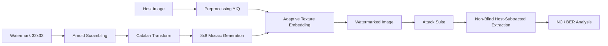

# Hybrid Image Watermarking Framework
### Pre-ANN Non-Blind Baseline — Arnold-Catalan Transforms with Mosaic Distribution

[](https://www.python.org/downloads/)
[](https://opencv.org/)
[](https://github.com/)
[](https://github.com/)

## 📖 Overview
This repository implements a **Hybrid Digital Image Watermarking Framework** combining dual chaotic scrambling (Arnold + Catalan) with spatially redundant 8×8 mosaic distribution and perceptual adaptive embedding. This phase establishes a rigorous, reproducible **Non-Blind (Host-Subtracted) Baseline** for subsequent deep learning (ANN) optimization.

> **Important**: All extraction in this phase is **non-blind** — the original host image is required. Blind (ANN-based) extraction will be developed in Phase 3.

## 🚀 Key Features

### 🛡️ Dual-Security Scrambling
- **Arnold Cat Map (ACM)**: Chaotic spatial transformation to remove global spatial correlations.
- **Catalan Transform**: Secondary deterministic permutation using Blake2b-hashed Catalan sequences.
- **Perfect Reconstruction**: Fully reversible mathematical transformations.

### 🧩 Redundancy & Adaptivity
- **8×8 Mosaic Generation**: Tiling of the 32×32 scrambled watermark into a 256×256 mosaic (64 redundant copies).
- **Perceptual Adaptive Embedding**: Local luminance-texture variance masking (PSNR > 41 dB).

### 💥 Standardized Attack Suite
- **Geometric**: Center, Random (Seeded), and Quadrant cropping (10%, 25%, 50% area removal).
- **Collaborative**: Averaging-based Collusion ($N \in \{2, 5, 10, 20, 50, 100\}$) using the standard fingerprinting model (1 victim + N-1 independent watermarks).
- **Signal Processing**: JPEG ($Q \in \{50, 70\}$), Gaussian Noise ($\sigma = 0.05$), Gaussian Blur ($k = 3$).

## 🏗️ Architecture


```mermaid
graph LR
    H[Host Image] --> P[Preprocessing YIQ]
    W[Watermark 32x32] --> S1[Arnold Scrambling]
    S1 --> S2[Catalan Transform]
    S2 --> M[8x8 Mosaic Generation]
    P --> AE[Adaptive Texture Embedding]
    M --> AE
    AE --> EW[Watermarked Image]
    EW --> AT[Attack Suite]
    AT --> EX[Non-Blind Host-Subtracted Extraction]
    EX --> AN[NC / BER Analysis]
```

## 📊 Validated Benchmark Results (Pre-ANN Non-Blind Baseline)

All results use **non-blind (host-subtracted) extraction** across the fixed test split (**165 DIV2K test images**), verified bit-exact reproducible across repeated runs.

### Clean Embedding Imperceptibility

These metrics measure watermarked-image quality against the original host (no attack applied):

| Method | PSNR (dB) | SSIM |
| :--- | :--- | :--- |
| **Hybrid Framework** | **41.57** | **0.9965** |
| Baseline Method | 46.02 | 0.9983 |

### Attack Robustness (NC & BER)

| Attack Scenario | Hybrid NC | Hybrid BER | Baseline NC | Baseline BER | Observation |
| :--- | :--- | :--- | :--- | :--- | :--- |
| No Attack (Clean) | 0.9979 | 0.0000 | 0.9998 | 0.0000 | Both near-perfect |
| **Cropping (10%)** | **0.9977** | **0.0000** | 0.8238 | 0.0070 | **Hybrid: mosaic redundancy** |
| **Cropping (25%)** | **0.9972** | **0.0000** | 0.0979 | 0.0330 | **Hybrid: baseline center destroyed** |
| **Cropping (50%)** | **0.9954** | **0.0000** | -0.0006 | 0.0352 | **Hybrid: near-lossless at 50% removal** |
| JPEG ($Q=70$) | 0.4138 | 0.0276 | **0.4764** | 0.0645 | **Baseline better** (concentrated energy) |
| JPEG ($Q=50$) | 0.2724 | 0.0354 | **0.3418** | 0.0939 | **Baseline better** (higher single-tile $\alpha$) |
| **Gaussian Noise** ($\sigma=0.05$) | **0.4325** | **0.0998** | 0.2932 | 0.2098 | **Hybrid: 64-tile averaging** |
| Gaussian Blur ($k=3$) | 0.2133 | 0.0555 | **0.2768** | 0.1093 | **Baseline better** (spatial smoothing) |
| **Collusion ($N=2$)** | **0.4892** | **0.0620** | 0.4477 | 0.1004 | Hybrid slightly better |
| Collusion ($N=5$) | 0.2554 | 0.2393 | 0.2152 | 0.2791 | Both degraded |
| Collusion ($N=10$) | 0.1521 | 0.3339 | 0.1196 | 0.3720 | Severe dilution |
| Collusion ($N=20$) | 0.0944 | 0.3992 | 0.0649 | 0.4288 | Near-random |
| Collusion ($N=100$) | 0.0241 | 0.4776 | 0.0148 | 0.4828 | Effectively destroyed |

### Analysis

- **Hybrid advantage — Cropping**: Mosaic spatial redundancy distributes 64 tile copies across the image. Even 50% area removal preserves enough tiles for near-perfect recovery (NC > 0.99). This is the framework's primary design objective.
- **Hybrid advantage — Gaussian noise**: 64-tile averaging suppresses additive noise by ~√64 = 8× compared to single-tile extraction.
- **Baseline advantage — JPEG & blur**: The baseline embeds at a higher concentrated strength ($\alpha = 0.08$) in a single center tile, providing better energy preservation against frequency-domain (DCT quantization) and spatial smoothing attacks compared to the hybrid's distributed lower strength ($\alpha_{base} = 0.012$).
- **Collusion**: Under the standard fingerprinting model (1 victim + N-1 independent watermarks), both methods degrade as the victim's signal is diluted to ~1/N strength. The non-blind extractor cannot meaningfully recover the watermark beyond N ≈ 5–10 colluders.

## 🛠️ Installation & Reproduction

1. **Environment Setup**
   ```bash
   git clone https://github.com/mjeni/Capstone-Code.git
   cd Capstone-Code
   pip install -r requirements.txt
   ```

2. **Run Unit & Integration Tests**
   ```bash
   python -m pytest -v
   python verify.py
   ```

3. **Run Full Reproducible Benchmark**
   ```bash
   # Run full 165-image test split evaluation
   python benchmark.py

   # Or run a quick smoke test on 5 images
   python benchmark.py --num_images 5

   # Print formatted summary table
   python summarise_results.py
   ```

4. **Generate Visualization Curves**
   ```bash
   python plot_collusion_curve.py
   python plot_tradeoff.py
   ```

5. **Generate Phase-3 Training Dataset**
   ```bash
   python create_training_data.py
   ```

## 📂 Project Structure

```
Capstone-Code/
├── attacks/                        # Attack engines (Cropping, Signal, Collusion)
│   ├── __init__.py
│   ├── collusion.py
│   ├── cropping.py
│   └── signal.py
├── utils/                          # Core algorithms & data utilities
│   ├── __init__.py
│   ├── adaptive_embedder.py        # Perceptual texture-luminance adaptive embedder
│   ├── baseline.py                 # Center single-tile baseline embedder
│   ├── catalan.py                  # Blake2b-keyed Catalan permutation
│   ├── downloader.py               # DIV2K dataset downloader
│   ├── loader.py                   # Image loading & validation
│   ├── metadata_mgr.py             # Metadata and split management
│   ├── mosaic.py                   # 8x8 Mosaic tile generator
│   ├── processor.py                # YIQ conversion & normalization
│   └── scrambler.py                # Arnold Cat Map scrambler
├── tests/                          # Automated Pytest suite
│   ├── __init__.py
│   ├── test_components.py          # Unit tests for transforms, embedders, attacks
│   └── test_pipeline.py            # Integration tests for end-to-end roundtrip
├── data/                           # Watermark & dataset inputs
├── preprocessed/                   # Normalized YIQ I-channel host data & previews
├── splits/                         # Fixed train / val / test dataset splits
├── benchmark.py                    # Unified Pre-ANN baseline benchmarker (CLI & API)
├── create_training_data.py         # Phase-3 training pair generator
├── generate_watermark.py           # Canonical binary watermark generator
├── main.py                         # Complete end-to-end preprocessing pipeline
├── plot_collusion_curve.py         # Collusion sensitivity curve plotting
├── plot_tradeoff.py                # PSNR vs NC trade-off curve plotting
├── summarise_results.py            # Comparison table report printer
├── verify.py                       # Data integrity verification script
├── visualize_rgb_reconstruction.py # RGB domain watermarked preview tool
└── collusion_analysis.html         # Interactive web visualization dashboard
```

## 🎓 Academic Context
This project is part of a Capstone research study on robust digital image watermarking. This phase establishes the authoritative **Non-Blind Baseline** prior to developing the blind ANN extractor in Phase 3. The non-blind results represent theoretical upper bounds for host-subtracted extraction and should not be compared directly with blind extraction performance.

---
**Author:** PW26_PAC_01  
**Year:** 2026
