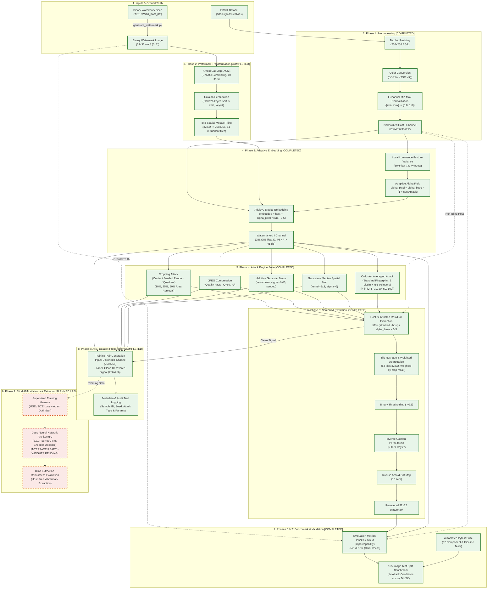
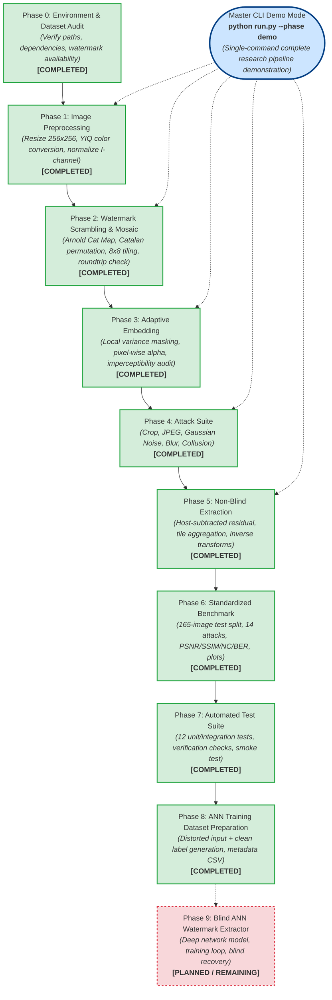

# Hybrid Image Watermarking Pipeline — Implementation Architecture

This document provides complete Mermaid architecture diagrams representing the Capstone Robust Image Watermarking system.

---

## 1. System Component & Data Flow Architecture

The diagram below details every component, data transformation, input, output, attack module, evaluation system, validation harness, ANN dataset preparation pipeline, and planned future ANN work.

Status Legend:
- **COMPLETED**: Fully implemented, tested, and validated.
- **PARTIAL / IN PROGRESS**: Functional scaffolding or initial data generation ready.
- **PLANNED / REMAINING**: Future design interfaces (Blind ANN Extractor) clearly separated from current verified code.

---

## 2. Pipeline Execution Sequence

The diagram below maps the execution hierarchy of the master CLI (`run.py`), showing each phase dependency and status.

